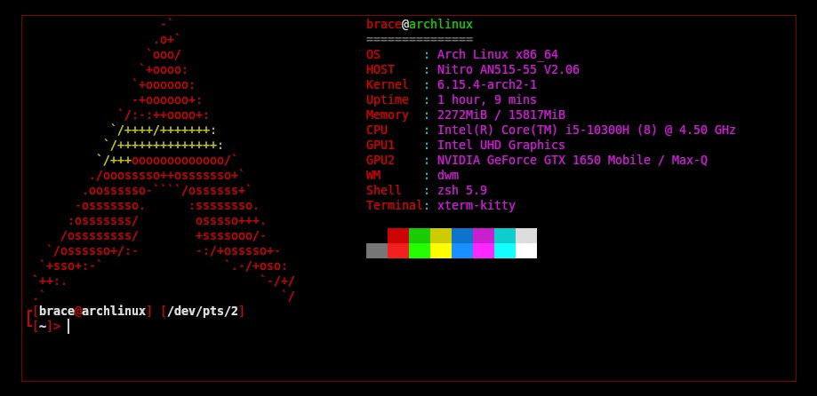

# fetcha - suckless-like system info fetch
fetcha is an fast, small and easy configurated system info fetch.


## Requirements
To insatll fetcha you need `git`.
## Installation
1. clone the repository.
```
git clone https://github.com/Cryobs/fetcha
```
2. go to `fetcha` directory
```
cd fetcha
```
3. build fetcha (if necessary as root)
```
make clean install
```
## Running fetcha
```
fetcha
```
If you want fetcha to open together with your terminal, add the line `fetcha` to the end of `~/<your-shell>rc` (for example `.bashrc`, `.zshrc`).
## Configuration
The configuration is similar to suckless-type programs, i.e., copy the `config.def.h` file to `config.h`, and after customizing `config.h`, you need to recompile the source code. 
(How to configure see the man pages ( fetcha-config(5) ))
